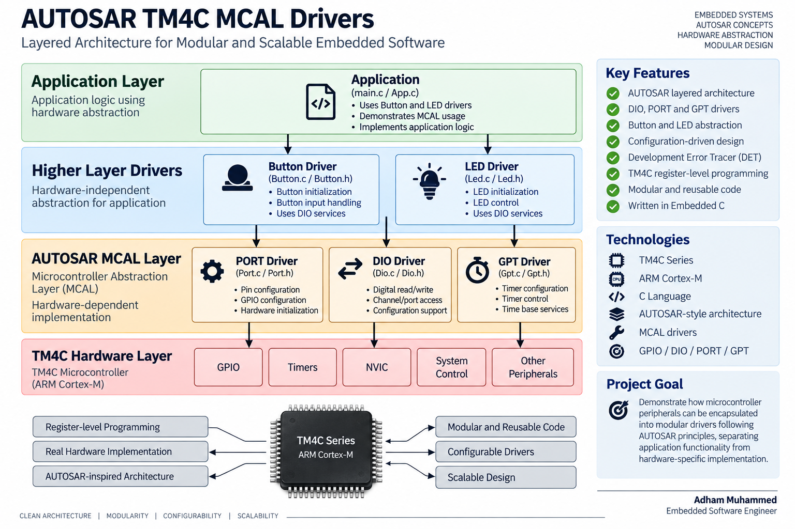

# AUTOSAR TM4C MCAL Drivers

An AUTOSAR-based embedded software project implementing MCAL-level drivers for the TM4C microcontroller.

The project applies AUTOSAR layered architecture concepts to separate hardware-dependent code from higher-level application modules, providing modularity, configurability, and hardware abstraction.

---

## Project Overview

This project demonstrates the implementation of AUTOSAR-style MCAL drivers targeting a TM4C microcontroller.

The software is structured into independent modules, with configuration separated from driver implementation. This allows hardware-dependent functionality to be accessed through clear driver interfaces while keeping higher-level application logic separated from the microcontroller hardware.

---

## System Architecture

    Application Layer
            |
            v
    +-------------------+
    |   Button / LED    |
    |    Application    |
    +---------+---------+
              |
              v
    +---------------------------+
    |          MCAL             |
    |                           |
    |   PORT    DIO    GPT      |
    +------------+--------------+
                 |
                 v
          TM4C Hardware

The architecture separates application functionality from microcontroller-specific implementation.

---

## MCAL Drivers

### DIO Driver

The DIO driver provides digital input/output functionality through an AUTOSAR-style interface.

Implemented functionality includes:

- DIO channel access
- DIO port access
- Digital read/write operations
- Channel-level configuration
- Port-level operations
- Configuration-based initialization

### PORT Driver

The PORT driver is responsible for configuring the microcontroller pins.

It provides the abstraction between the application/driver layers and the TM4C GPIO hardware configuration.

### GPT Driver

The GPT driver provides General Purpose Timer functionality for the microcontroller.

It handles timer configuration and control while keeping timer-related hardware access isolated within the driver.

---

## Application Drivers

### Button Driver

The Button driver provides an abstraction for handling button inputs without requiring the application to directly access TM4C GPIO registers.

### LED Driver

The LED driver provides a simple interface for controlling LEDs through the underlying DIO functionality.

This demonstrates how higher-level modules can use MCAL services instead of accessing hardware registers directly.

---

## Configuration

Configuration is separated from the core driver implementation.

Examples include:

- `Dio_Cfg.h`
- `Dio_PBcfg.c`
- `Button_Cfg.h`
- `Led_Cfg.h`

This approach allows hardware configuration to be modified independently from the driver implementation.

---

## Development Error Tracer

The project includes a Development Error Tracer (DET) module for development-time error reporting.

    Driver
       |
       v
    Error Detection
       |
       v
      DET

This provides a structured mechanism for detecting and reporting driver development errors.

---

## Hardware Abstraction

The application does not need to directly manipulate TM4C registers for basic digital I/O operations.

Instead:

    Application
         |
         v
    Button / LED Driver
         |
         v
    DIO / PORT Driver
         |
         v
    TM4C Registers

This separation improves modularity and makes the software easier to maintain and reuse.

---

## Project Structure

    AUTOSAR-TM4C-MCAL-Drivers/
    |
    +-- App.c
    +-- App.h
    |
    +-- Dio.c
    +-- Dio.h
    +-- Dio_Cfg.h
    +-- Dio_PBcfg.c
    +-- Dio_Regs.h
    |
    +-- Gpt.c
    +-- Gpt.h
    |
    +-- Button.c
    +-- Button.h
    +-- Button_Cfg.h
    |
    +-- Led.c
    +-- Led.h
    +-- Led_Cfg.h
    |
    +-- Det.c
    +-- Det.h
    |
    +-- Compiler.h
    +-- Common_Macros.h
    |
    +-- main.c
    |
    +-- targetConfigs/

---

## Engineering Concepts Demonstrated

- AUTOSAR layered architecture
- MCAL driver development
- Hardware abstraction
- Modular embedded software design
- Configuration-driven development
- TM4C register-level programming
- DIO driver implementation
- PORT driver implementation
- GPT driver implementation
- Button and LED abstraction
- Embedded C
- Development error handling
- Separation of configuration and implementation
- Driver-to-application abstraction

---

## Target Platform

| Component | Technology |
|---|---|
| Microcontroller | TM4C Series |
| CPU Architecture | ARM Cortex-M |
| Programming Language | C |
| Software Architecture | AUTOSAR-style layered architecture |
| Driver Layer | MCAL |
| Peripherals | GPIO / DIO / PORT / GPT |

---

## Key Takeaway

The project demonstrates how microcontroller peripherals can be encapsulated into modular drivers following AUTOSAR architectural principles.

Instead of allowing application code to directly depend on hardware registers, the project introduces driver interfaces and configuration layers that separate application functionality from hardware-specific implementation.

This provides a foundation for developing scalable and maintainable automotive embedded software.

---

## Author

**Adham Muhammed**

Embedded Software Engineer

Interested in Embedded Software, Automotive Systems, AUTOSAR, and Real-Time Systems.
